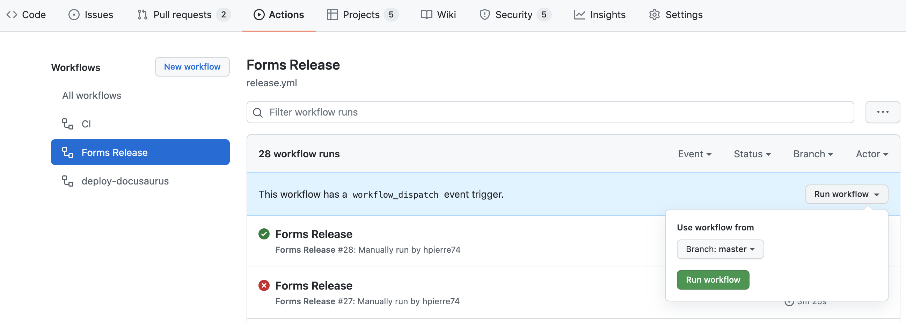

# Release & Publish

This repository contains several npm packages that are released through [@jscutlery/semver](https://github.com/jscutlery/semver) in a sync strategy (packages share the same version number) in a Github Actions pipeline through a [release workflow](../.github/workflows/release.yml).

## How does it work ?

[@jscutlery/semver](https://github.com/jscutlery/semver) offers various NX executors to perform the version bump, the changelog generation and push to github.

In our case, we version the entire NX workspace altogether to keep versions in sync, thus, we have a `workspace` project configured in our `workspace.json` file which contains the `version` and `github` **targets**.

When the `version` target is executed, [@jscutlery/semver](https://github.com/jscutlery/semver) finds the right version to bump in all relevant `package.json` and generate changelogs for each packages and for the workspace (which contains the combined changelogs).
Once the `version` target has done its job, it calls the **postTargets** sequentially.
The first **postTarget** is the `workspace:github` one, responsible for pushing changelogs to github.
Then, the remaining **postTargets** are for publishing each packages to npm.
And voilà :tada:

## Releasing a new version

> The only viable way to release and publish our packages in a consistent manner is through CI.

The release and publish process is fairly simple, it's a single click action. You can directly trigger the [release workflow](../.github/workflows/release.yml) from the [Github Actions Tabs](https://github.com/BedrockStreaming/forms/actions/workflows/release.yml).



### How to version and publish another package than the already configured ones ?

Inside your (new) library's `project.json`, add a **publish** target like so:

```json
{
  "targets": {
    // [...]
    "publish": {
      "executor": "ngx-deploy-npm:deploy",
      "options": {
        "baseBranch": "master",
        "access": "public"
      }
    }
  }
{
```

Then in the `workspace.json` file, add the publish target to your workspace version `postTargets`:

```json
{
  "projects": {
    "workspace": {
      "root": ".",
      "targets": {
        "version": {
          "executor": "@jscutlery/semver:version",
          "options": {
            "baseBranch": "master",
            "push": true,
            "noVerify": true,
            "commitMessageFormat": "release(${projectName}): publish version ${version}",
            "postTargets": [
              "workspace:github",
              "form-builder:publish",
              "form-validation-rule-list:publish",
              "form-redux:publish",
              "form-editor:publish"
              "my-lib:publish" // <========= append it here
            ]
          }
        }
      }
    }
  }
}
```

## Caveats

:warning: Changelog are not properly pushed on Github, bug is being investigated in `@jscutlery/semver`
